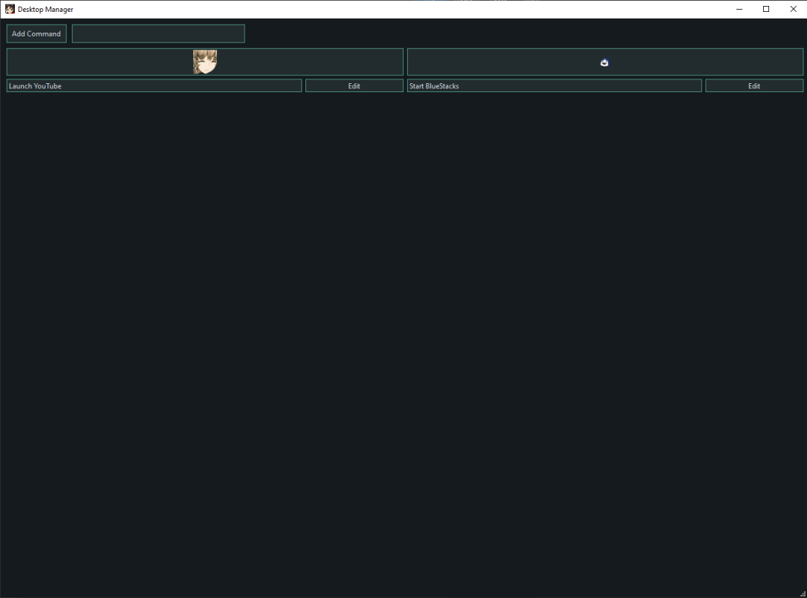
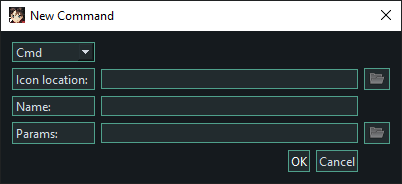
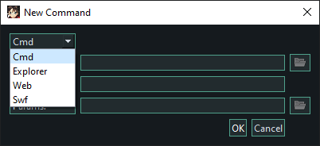
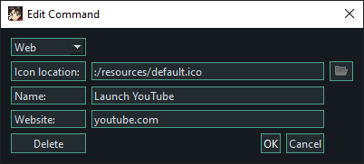

# DesktopManager

Desktop Manager designed to move 15 shortcuts on your hotbar into one place

Supports running programs through cmd, launching explorer windows, launching websites and launching .swf files  
.swf files require a valid flash player path to be put in the config.scuff file located in users\user\local\ScuffManager\config.scuff

Adding a new command is simple

  
Choose command type  
Optionally choose icon, default used if left empty    
Choose command name  
Choose params:  
- cmd: valid executable (.exe, .bat, .msi, .cmd, .ps1)
- exp: folder
- web: website url (no http/https prefix)
- swf: path to .swf file

Commands can be edited after the fact

Clicking Delete or pressing Delete on keyboard will immediately delete the command  
both from the program and from disk  

Commands are saved at C:\users\\[USER]\AppData\Local\ScuffManager in a folder given name as an md5 hash of the command function  
This should prevent collisions, but md5 collisions are not impossible so there is a chance
